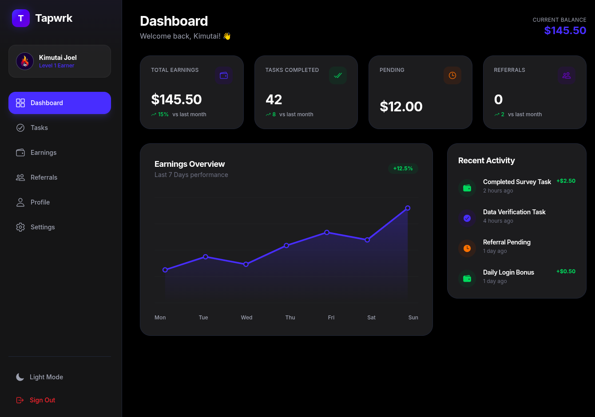
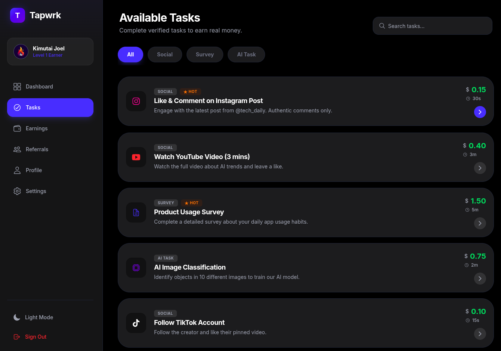
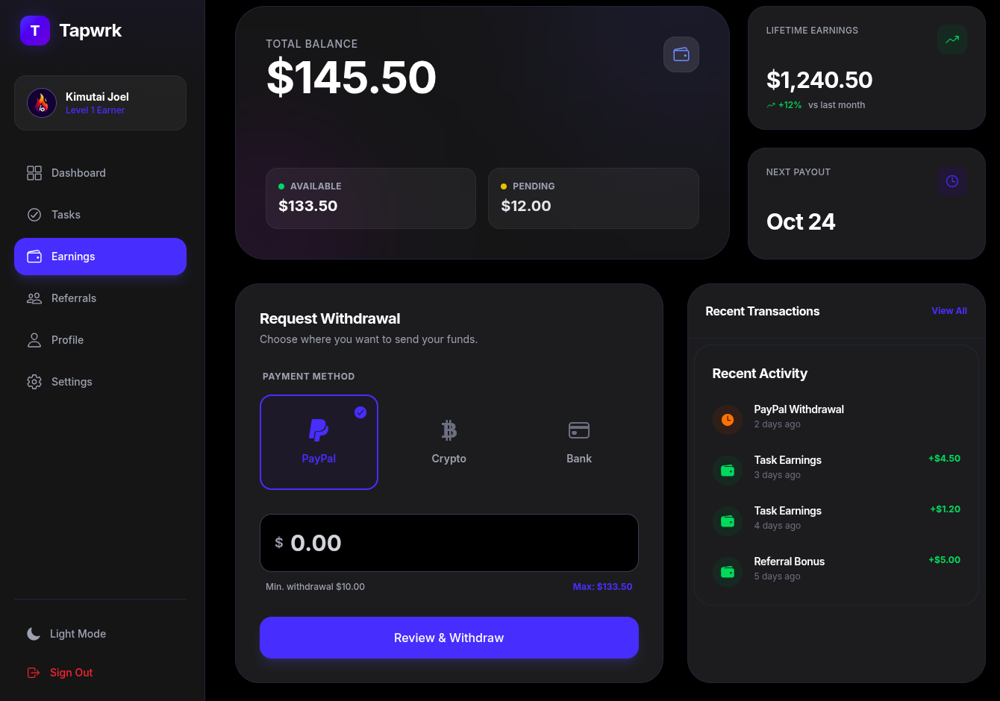
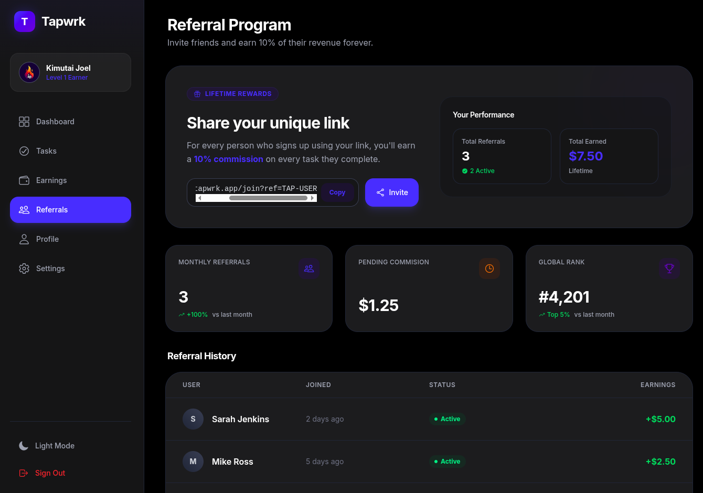
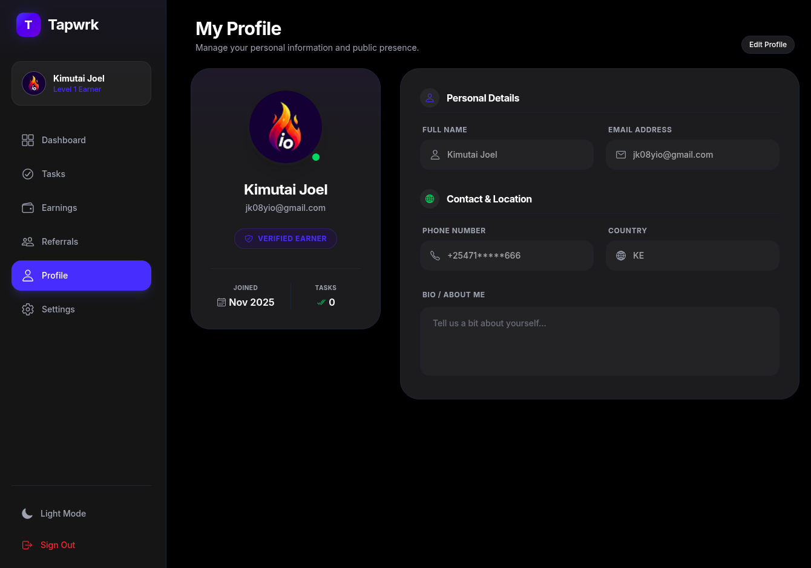
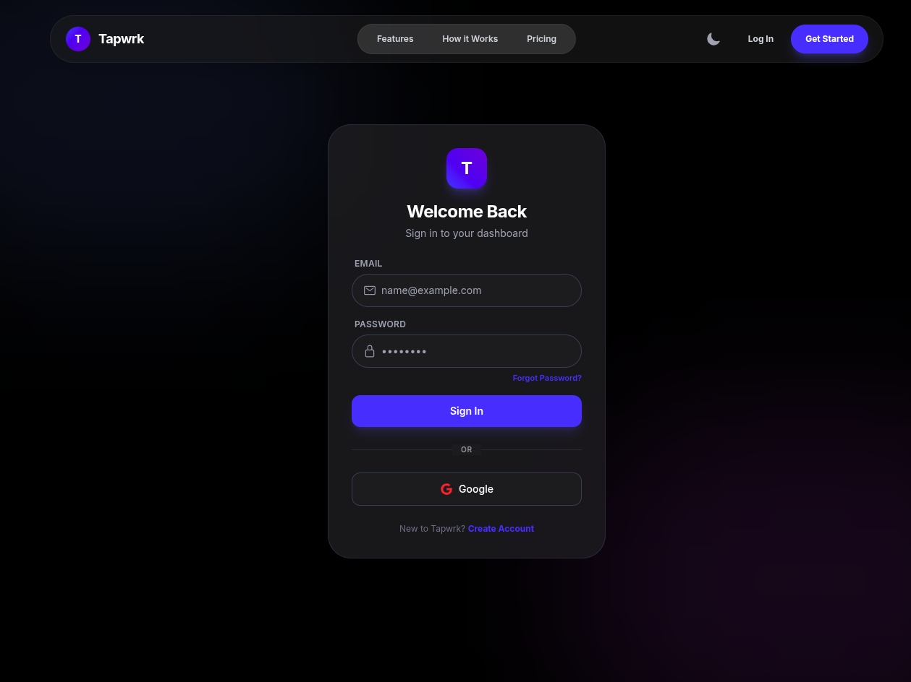

# Tapwrk - Micro-Jobs Platform

Tapwrk is a modern, high-end web application that connects users with micro-tasks from global brands. Designed with a premium "Apple-like" aesthetic, it features a seamless user experience, real-time earnings tracking, and a robust referral system.

## Project Overview

Tapwrk reimagines the micro-tasking economy by prioritizing user experience and trust. Unlike cluttered, dated earning sites, Tapwrk offers a clean, distraction-free interface that works beautifully on both desktop and mobile devices.

This project serves as a production-ready template for building modern SaaS applications with complex dashboard requirements, authentication flows, and responsive layouts.

**Note**: This project is currently in active development. The UI and authentication systems are largely complete, while backend integration, payment processing, and additional features are still being implemented.

## Key Features

- **Premium UI/UX**: Glassmorphism effects, smooth Framer Motion animations, and a consistent iOS-inspired design system
- **Responsive Dashboards**: Data-rich interfaces that adapt perfectly from large desktop monitors to mobile screens
- **Authentication System**: Secure Google & Email login with a mandatory profile completion flow
- **Task Management**: Filterable task lists with detailed modal views and clear instruction steps
- **Wallet & Earnings**: Visual earnings breakdown, lifetime stats, and withdrawal interface
- **Referral System**: A complete affiliate dashboard with copy-paste tools and social sharing
- **Dark Mode**: Fully supported system-wide dark mode with automatic switching

## Screenshots

### Dashboard & Analytics

The command center for earners. Real-time stats, charts, and recent activity.



### Task Management

Browse available tasks with smart filtering. The detailed modal ensures users know exactly what to do.




### Wallet & Earnings

Track every cent. A beautiful, card-based interface for managing funds and withdrawals.



### Referral System

Growth engine. Users can invite friends and track their commissions in real-time.



### User Profile

Manage personal details and account settings with a clean, focused editor.



### Authentication

Secure, beautiful entry points into the application.



## Technology Stack

This project is built with a modern, performance-focused stack:

- **Frontend**: React 18 (Vite)
- **Styling**: Tailwind CSS 3.4 (Custom Config)
- **Animations**: Framer Motion
- **Routing**: React Router 6 (with animated transitions)
- **State Management**: React Context API
- **Backend / Auth**: Firebase (Authentication & Firestore)
- **Icons**: React Icons (IO5 pack)
- **Notifications**: React Toastify

## Getting Started

### Clone the Repository

```bash
git clone https://github.com/jk08y/tapwrk.git
cd tapwrk
```

### Install Dependencies

```bash
npm install
```

### Configure Environment

Create a `.env` file in the root directory and add your Firebase credentials:

```
VITE_FIREBASE_API_KEY=your_api_key
VITE_FIREBASE_AUTH_DOMAIN=your_auth_domain
VITE_FIREBASE_PROJECT_ID=your_project_id
VITE_FIREBASE_STORAGE_BUCKET=your_storage_bucket
VITE_FIREBASE_MESSAGING_SENDER_ID=your_sender_id
VITE_FIREBASE_APP_ID=your_app_id
```

### Run the Development Server

```bash
npm run dev
```

The application will start at `http://localhost:5173` (or the next available port).

## Design Philosophy

The design system is built on three core pillars:

**Clarity**: High contrast text, generous whitespace, and distinct visual hierarchy ensure every interface element is immediately understandable.

**Depth**: Extensive use of subtle shadows, borders, and blur effects create a sense of layering and visual sophistication.

**Feedback**: Every interaction—hover states, clicks, and focus events—receives immediate visual response, making the interface feel responsive and alive.

## Project Structure

```
tapwrk/
├── src/
│   ├── components/
│   ├── pages/
│   ├── context/
│   ├── App.jsx
│   └── main.jsx
├── public/
├── screenshots/
├── index.html
├── tailwind.config.js
├── vite.config.js
├── package.json
└── README.md
```

## Development Scripts

- `npm run dev` - Start the development server
- `npm run build` - Build for production
- `npm run preview` - Preview production build locally
- `npm run lint` - Run ESLint

## Contributing

We welcome contributions from the community! Feel free to fork this project and submit pull requests with improvements, bug fixes, or new features.

### How to Contribute

1. Fork the repository
2. Create a feature branch (`git checkout -b feature/your-feature`)
3. Commit your changes (`git commit -m 'Add your feature'`)
4. Push to the branch (`git push origin feature/your-feature`)
5. Open a Pull Request

## Support

If you find this project helpful, please consider giving it a star on GitHub. Your support helps us continue developing and improving Tapwrk.

[Star Tapwrk on GitHub](https://github.com/jk08y/tapwrk)

## License

This project is open-source and available under the MIT License. Feel free to use it as a template for your own SaaS projects.

## Credits

Built with assistance from Gemini 3.0.

---

**Tapwrk** - Micro-tasks. Macro earnings.